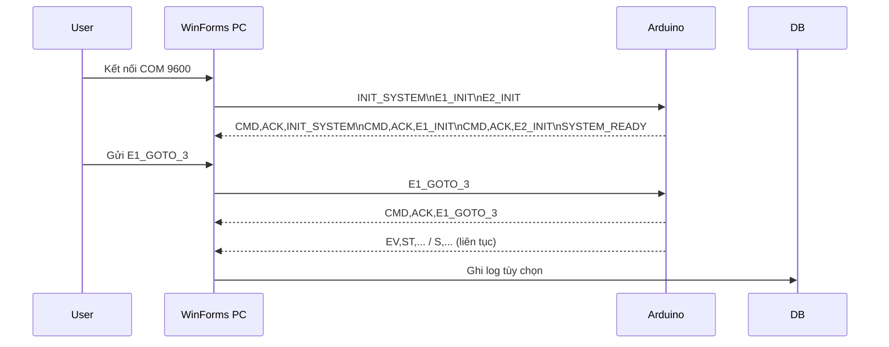

# Báo cáo hệ thống: Điều khiển thang máy (Arduino + WinForms)

Tác giả: Vo-Xuan-Duong  
Dự án: Project_Arduino_Control_Elevator  
Phiên bản tài liệu: 1.0  
Ngày: 09/09/2025

---

## Mục lục
- 1. Tóm tắt điều hành
- 2. Mục tiêu, phạm vi và bên liên quan
- 3. Yêu cầu hệ thống (chức năng/phi chức năng)
- 4. Kiến trúc tổng thể và luồng dữ liệu
- 5. Thiết kế chi tiết
  - 5.1 Ứng dụng PC (WinForms)
  - 5.2 Firmware Arduino
  - 5.3 Giao thức Serial (đặc tả)
  - 5.4 Cơ sở dữ liệu (lược đồ và truy cập)
- 6. Kế hoạch kiểm thử và tiêu chí nghiệm thu
- 7. Vận hành, triển khai và cấu hình
- 8. An toàn, bảo mật và tuân thủ
- 9. Rủi ro, hạn chế và biện pháp
- 10. Kết luận và hướng phát triển
- Phụ lục A: Sơ đồ/ánh xạ chân Arduino, LCD, nút, LED
- Phụ lục B: Danh mục lệnh và sự kiện Serial
- Phụ lục C: Cấu trúc config.json và mẫu
- Phụ lục D: Lược đồ SQL bảng và chỉ mục

---

## 1. Tóm tắt điều hành
Hệ thống mô phỏng/điều khiển 2 thang máy (6 tầng: 0–5) bằng bo Arduino và ứng dụng Windows Forms (.NET 8). Ứng dụng PC gửi lệnh điều khiển qua Serial; firmware Arduino xử lý logic vận hành (state machine cabin, mở/đóng cửa, gọi sảnh/cabin, phân bổ cabin tối ưu) và phát telemetry. Ứng dụng hỗ trợ ghi nhật ký thời gian thực vào PostgreSQL/Supabase để truy vết và phân tích.

Mục tiêu cao nhất: vận hành ổn định, phản hồi nhanh, giao thức rõ ràng, log có cấu trúc.

## 2. Mục tiêu, phạm vi và bên liên quan
Mục tiêu
- Xây dựng mô hình điều khiển 2 thang (E1, E2) trực quan, thao tác từ PC.
- Giao tiếp ổn định qua Serial, telemetry đủ dùng cho giám sát/phân tích.
- Lưu nhật ký chuẩn hóa vào PostgreSQL/Supabase.

Phạm vi
- Bao gồm: 2 cabin, 6 tầng, gọi sảnh theo hướng, nút cabin; lệnh điều khiển (đi đến tầng, mở/đóng cửa, dừng khẩn, báo cháy, bảo trì, khởi động lại); UI WinForms; firmware Arduino; logging DB.
- Không bao gồm: cơ khí, cảm biến an toàn thực tế, chuẩn an toàn công nghiệp.

Bên liên quan
- Sinh viên/kỹ sư phát triển, giảng viên/khách hàng đánh giá, người vận hành demo.

## 3. Yêu cầu hệ thống (chức năng/phi chức năng)
Chức năng
- Điều khiển 2 thang: chọn tầng từ UI; gọi sảnh theo hướng; mở/đóng cửa; dừng khẩn; báo cháy; bảo trì; khởi động lại.
- Hiển thị trạng thái thang và nhật ký theo loại (System, Elevator, User, Emergency, Error, Warning).
- Lưu nhật ký vào PostgreSQL/Supabase khi bật enableLogging.

Phi chức năng
- Độ trễ giao diện/Serial thấp (chu kỳ POLL ~10 ms ở firmware tối ưu; heartbeat snapshot ~100 ms).
- Tính ổn định: tự tạo cấu hình mặc định khi thiếu; tự kiểm tra CSDL và tạo bảng khi cần.
- Bảo trì: mã tách bạch, giao thức văn bản dễ debug, có chỉ mục DB theo thời gian/loại.

Ràng buộc
- Windows 10/11, .NET 8; Arduino Mega 2560; PostgreSQL 14+ hoặc Supabase (tùy chọn).

## 4. Kiến trúc tổng thể và luồng dữ liệu
- Tầng giao diện (WinForms): kết nối COM, gửi lệnh, nhận phản hồi; hiển thị/log; ghi DB.
- Tầng điều khiển (Arduino): state machine cabin, debounce nút, phân bổ cabin, LCD/LED, phát telemetry.
- Tầng dữ liệu (PostgreSQL): bảng elevator và log; ghi nhận metadata (phiên, máy, người dùng, ưu tiên).

Sơ đồ trình tự (rút gọn)


## 5. Thiết kế chi tiết

### 5.1 Ứng dụng PC (WinForms)
- Công nghệ: C#/.NET 8, Windows Forms; gói: System.IO.Ports, Npgsql.
- Tệp chính: `ControlThangMay/Form1.cs`, `Program.cs`, `Form1.Designer.cs`.
- Tính năng: quản lý COM/baud, điều khiển thang, lọc log, ghi DB (khi bật), cập nhật UI theo trạng thái.
- Logging DB: ánh xạ mức ưu tiên theo loại log (Emergency=4, Error=3, Warning/System=2, Elevator/User=1).

### 5.2 Firmware Arduino
- Khuyến nghị dùng `ControlThangMay/elevator_control_arduino.ino` (tối ưu realtime: POLL 10 ms, debounce 15 ms, heartbeat 100 ms).
- State machine cabin: IDLE → MOVE → ARRIVED → DOOR_OPEN → WAIT → DOOR_CLOSE → WAIT_PICK → (MOVE|IDLE).
- Debounce nhóm cho nút sảnh (10), cabin A (6), cabin B (6), mở/đóng (mỗi cabin 1).
- Phân bổ cabin: tính điểm theo khoảng cách, hướng trùng, đang rảnh/đang đi và độ dài hàng đợi.

### 5.3 Giao thức Serial (đặc tả)
- Mã hóa: văn bản ASCII, mỗi khung kết thúc bằng \n; Baud mặc định 9600.
- Lệnh từ PC (mẫu):
  - INIT_SYSTEM | E1_INIT | E2_INIT
  - E1_GOTO_<floor> | E2_GOTO_<floor>
  - E1_STOP | E2_STOP | E1_OPEN_DOOR | E2_OPEN_DOOR | E1_CLOSE_DOOR | E2_CLOSE_DOOR | E1_RESTART | E2_RESTART
  - CALL_TO_FLOOR_<floor>_[UP|DOWN]
  - EMERGENCY_STOP_ALL | FIRE_ALARM | MAINTENANCE_MODE | SYSTEM_RESTART | SYSTEM_SHUTDOWN
- Phản hồi/telemetry từ Arduino:
  - `CMD,ACK,<COMMAND>` | `CMD,ERROR,UNKNOWN_COMMAND,<raw>` | `SYSTEM_READY`
  - `EV,BTN,<grp>,<idx>,<pressed>,<t>` (grp: H=hall, A=cabA, B=cabB, O=open, C=close)
  - `EV,ST,<car>,<floor>,<dir>,<state>,<t>` (car: A/B; dir:-1/0/1; state:0..6)
  - `S,<t>,Af,Ad,As,Aup,Adn,Bf,Bd,Bs,Bup,Bdn,hall,cabA,cabB,open,close`

### 5.4 Cơ sở dữ liệu (lược đồ và truy cập)
- Script chuẩn: `ControlThangMay/simple_setup.sql` (bảng elevator + log, RLS cho Supabase, chỉ mục thời gian/loại).
- Ứng dụng có thể tự tạo bảng tối thiểu nếu kết nối thành công.
- Kết nối Npgsql với chuỗi: `Host;Port;Database;Username;Password;SSL Mode=Require|Disable;Timeout=30`.

## 6. Kế hoạch kiểm thử và tiêu chí nghiệm thu
Kiểm thử chức năng
- Kết nối COM/baud 9600, nhận `SYSTEM_READY` và `CMD,ACK` cho lệnh hợp lệ.
- Gọi sảnh: nút tầng 3 hướng UP → cabin gần hơn/hàng đợi ít hơn được chọn (LED pick cabin bật).
- Chọn tầng trong cabin → cabin di chuyển đúng, phát `EV,ST` và `S` đúng định dạng.
- Dừng khẩn, báo cháy, bảo trì: trạng thái cabin/LED/LCD thay đổi đúng.

Kiểm thử phi chức năng
- Độ trễ nhận snapshot `S` ~100 ms (phiên bản tối ưu); không mất khung với tốc độ thao tác bình thường.
- Ghi DB thành công khi enableLogging=true; không làm treo UI khi DB tạm thời mất kết nối (ghi lỗi mềm).

Nghiệm thu
- Tất cả kịch bản chính chạy thành công; log được lưu (nếu bật); giao thức đúng mô tả; không lỗi nghiêm trọng.

## 7. Vận hành, triển khai và cấu hình
Triển khai nhanh
- Firmware: mở `ControlThangMay/elevator_control_arduino.ino` trong Arduino IDE → Board Mega 2560 → Baud 9600 → Upload.
- CSDL (tùy chọn): chạy `ControlThangMay/simple_setup.sql`; chỉnh `ControlThangMay/config.json` (SSL, tài khoản, mật khẩu, enableLogging).
- Ứng dụng PC: mở `ControlThangMay/ControlThangMay.sln` bằng Visual Studio 2022 → Build Debug → chạy.

Cấu hình
- `config.json`: host, port, database, username, password, enableSSL, enableLogging.
- Ứng dụng tự tạo `config.json` mặc định nếu thiếu.

## 8. An toàn, bảo mật và tuân thủ
- Đây là mô phỏng; không thay thế hệ thống an toàn thang máy thật.
- Serial không mã hóa; cân nhắc lớp bảo mật nếu truyền qua môi trường không tin cậy.
- Bảo mật thông tin DB lưu cục bộ; phân quyền thư mục/chính sách mật khẩu.

## 9. Rủi ro, hạn chế và biện pháp
- Phụ thuộc nhiều IO → khuyến nghị Mega 2560; nếu thiếu IO, cần mở rộng/đổi sơ đồ chân.
- Không có mô hình động lực học/mô-đun driver động cơ thật.
- Biện pháp: tách mô-đun, thêm test, dashboard giám sát, tăng cường giao thức (checksum/binary), tích hợp MQTT.

## 10. Kết luận và hướng phát triển
Hệ thống đáp ứng mục tiêu mô phỏng điều khiển 2 thang, giao thức rõ ràng, có logging DB. Hướng phát triển: dashboard realtime (WPF/Blazor), authentication/authorization, giao thức bảo mật, IoT từ xa, test tự động.

---

## Phụ lục A: Sơ đồ/ánh xạ chân Arduino, LCD, nút, LED
LCD
- Cabin A: LiquidCrystal(2, 3, 4, 5, 6, 7) → rs=2, en=3, d4=4, d5=5, d6=6, d7=7
- Cabin B: LiquidCrystal(8, 9, 10, 11, 12, 13)

Nút cabin và LED
- Cabin A: nút tầng 23–28; LED tầng 46–51
- Cabin B: nút tầng 30–35; LED tầng 52, 53, A0, A1, A2, A3

Nút sảnh (10 nút cho 5 tầng, 2 hướng): 36–45

Cảm biến/mở-đóng cửa (theo mã):
- Cabin A: mở A6, đóng 22
- Cabin B: mở A7, đóng 29

Chỉ thị cabin được chọn: A4 (A), A5 (B)

## Phụ lục B: Danh mục lệnh và sự kiện Serial
Lệnh từ PC
- INIT_SYSTEM | E1_INIT | E2_INIT
- E1_GOTO_<floor> | E2_GOTO_<floor>
- E1_STOP | E2_STOP | E1_OPEN_DOOR | E2_OPEN_DOOR | E1_CLOSE_DOOR | E2_CLOSE_DOOR | E1_RESTART | E2_RESTART
- CALL_TO_FLOOR_<floor>_[UP|DOWN]
- EMERGENCY_STOP_ALL | FIRE_ALARM | MAINTENANCE_MODE | SYSTEM_RESTART | SYSTEM_SHUTDOWN

Phản hồi/telemetry
- CMD,ACK,<COMMAND> | CMD,ERROR,UNKNOWN_COMMAND,<raw> | SYSTEM_READY
- EV,BTN,<grp>,<idx>,<pressed>,<t>
- EV,ST,<car>,<floor>,<dir>,<state>,<t>
- S,<t>,Af,Ad,As,Aup,Adn,Bf,Bd,Bs,Bup,Bdn,hall,cabA,cabB,open,close

## Phụ lục C: Cấu trúc config.json và mẫu
Trường
- database.host: chuỗi host
- database.port: số cổng (mặc định 5432)
- database.database: tên DB
- database.username/password
- database.enableSSL: true/false
- database.enableLogging: true/false

Mẫu
```json
{
  "database": {
    "host": "localhost",
    "port": 5432,
    "database": "postgres",
    "username": "postgres",
    "password": "123456",
    "enableSSL": false,
    "enableLogging": true
  }
}
```

## Phụ lục D: Lược đồ SQL bảng và chỉ mục
- Bảng elevator (elevator_id PK, code UNIQUE, display_name)
- Bảng log: thời gian, loại, thông điệp, elevator_id FK(elevator), current_floor, target_floor, command_sent, session_id, machine_name, user_name, priority (1–4)
- Chỉ mục: `ix_log_created_at (created_at DESC)`, `ix_log_type_time (type, created_at DESC)`

---
Tài liệu này tổng hợp từ mã nguồn hiện tại. Khi thay đổi phần cứng/mã nguồn, vui lòng cập nhật lại các mục tương ứng.
